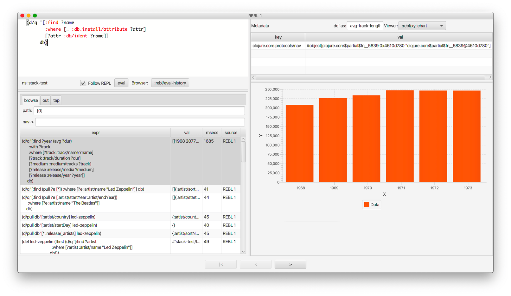

= Morse
Fogus
2023-04-20
:type: guides
:toc: macro
:icons: font

ifdef::env-github,env-browser[:outfilesuffix: .adoc]

toc::[]

[[introduction]]

== Why Morse?
One of the prime value propositions in using a Lisp language is that you should be able to interact with your live program. The typical access mechanism for Clojure programs is the REPL, but its print-oriented streaming nature limits interactive and graphical data exploration.

Morse, like REBL before it, is a library that provides a graphical browser for Clojure data that allows active traversal into and back out of nested structures. REBL was intended to sit in the middle of your editor<->process REPL streams and automatically render and cache all REPL results. This made it difficult to integrate in dev environments that used other than raw streaming REPLs. In Morse the emphasis is now on inspecting on demand via the `inspect` API, and REPL interception is strictly optional. This should make Morse easy to integrate with all dev setups.

It's not always feasible to execute a graphical browser process inside of the program process, e.g. when the inspected program is running remotely. Morse can be configured to connect to and inspect a remote program, a facility built on the new Replicant* libraries. Morse uses Replicant to efficiently and incrementally traverse remote data, extending its power to a variety of new use cases.

== Clojure, Morse and the Lisp Value Proposition
Clojure lets programmers solve problems by staying connected to their running programs and live data, incrementally building up both the program and their understanding of the problem they are trying to solve. Morse, Replicant, and the new add-libs features of Clojure version 1.12.0-alpha2 all work together to amplify the power of the programmer during interactive development.

This software is considered an alpha release and subject to change.

== Usage

Morse has two modes of operation: in-process and remote inspection. In this section we'll outline some common use cases and describe how to use Morse in each case.

[[in-proc]]
=== I would like to run Morse in my process and use it to inspect application state during development

Like REBL, Morse can run inside of your application process and access its full power. To add Morse as a `:dev` dependency, simply add the following to your deps.edn file:

[source,clojure]
----
:aliases
{:dev
  {:extra-deps {io.github.nubank/morse {:git/tag "v2023.04.20.02" :git/sha "0bf4b9f"}}}
}
----

With this dependency in place you can run your Clojure REPL with the `:dev` alias active to make Morse available on the classpath. You can `require` Morse with the following:

[source,clojure]
----
(require '[dev.nu.morse :as morse])
----

Once loaded, a Morse UI is launched with the `ui` function:

[source,clojure]
----
(morse/ui :mode :in-proc)
----

The Morse API provides an `inspect` function taking an object and displaying it in the Morse UI. 

[source,clojure]
----
(morse/inspect {:a 1 :b 2})
----

You should see the map `{:a 1 :b 2}` in the data Morse data browser.

The Morse API also provides an `eval` function that takes a Clojure form and evaluates it in the context of the hosting process.

[source,clojure]
----
(morse/eval '(+ 1 2))
----

You should see the number 3 in the Morse data browser.

Having Morse available as a nimble data inspector in your development process provides a powerful lever for understanding application state and data collections.

[[out-of-process]]
=== I would like to connect Morse to an external process that depends on Replicant Server

Using a project with Morse in its dependencies like described in the previous section, you can connect to a different process named PROC2 running a Replicant Server using the steps in this section.

Morse Remote inspection requires two parts to operate. First, a server component link:https://github.com/clojure/replicant-server[replicant-server] runs in the process you wish to inspect (often your REPL). Second, Morse itself acts as a client to that active Replicant server.

In the deps.edn file for PROC2 you can add the following:

[source,clojure]
----
{:dev
  {:extra-deps
    {io.github.clojure/data.alpha.replicant-server {:git/tag "v2023.04.20.01" :git/sha "8c02f64"}}}
}
----

After starting PROC2 you can run the following to start a remote Replicant:

[source, clojure]
----
(require '[clojure.data.alpha.replicant.server.prepl :as rs])
(rs/start-replicant)
----

By default, replicant-server runs on localhost port 5555 but is configurable per the instructions in the link:https://github.com/clojure/replicant-server[replicant-server] repository.

[source,clojure]
----
(require '[dev.nu.morse :as morse])
(morse/morse {:mode :external, :host "localhost", :port 5555})
----

Once connected, the REPL pane in Morse is a remote client of the server (via a socket) of an active link:https://github.com/clojure/data.alpha.replicant-server[Replicant server]. Expressions you type into Morse are evaluated in the context of the process hosting the Replicant server. This is just like any remote socket-based repl. You can modify the remote inspection parameters to match your replicant-server launch by passing an options map to the `clj` command above:

[[out-of-process-bootstrap]]
=== I would like to connect Morse to an external process that does not depend on Replicant Server

Since version 1.12-alpha2, Clojure provides a capability to add dependencies at runtime using the `add-lib` function available in the REPL. If your application process is running in a REPL then you can leverage Morse as needed by executing the following steps. This capability relies on https://clojure.org/guides/deps_and_cli[Clojure CLI] 1.11.1.1267 or later to function.

First, in your running process you can add the link:https://github.com/clojure/data.alpha.replicant-server[replicant-server] library at runtime using the `add-lib` function to load the latest version:

[source,clojure]
----
(add-lib 'io.github.clojure/data.alpha.replicant-server {:git/tag "v2023.04.20.01" :git/sha "8c02f64"})
----

This should load the replicant-server dependency into the running process which will allow you to `require` the Replicant namespace and start as server as outlined in the previous section.

[[ide-use]]
=== I would like to use Morse in my Clojure IDE of choice

Morse is used as a dependency just like any other Clojure library and therefore available in your IDE of choice either running in-process or external. See the previous sections for how to add Morse as a dependency and for running it in or out of process.

[[tool-install]]
=== I would like to install Morse as a Clojure CLI tool

Morse is available as a Clojure CLI tool and may be installed and upgraded via:

    clj -Ttools install-latest :lib io.github.nubank/morse :as morse

That command installs a tool named "morse" that you can launch via:

    clj -Tmorse morse <options>

The <options> are optional key->value pairs accepting `:host` and `:port` mappings. If omitted, <options> default to `:host '"localhost"' :port 5555`.

[[limitations]]
== Limitations

Morse currently requires Java version 11 or higher.

By default Morse runs with the latest version of JavaFX but if you need to run Morse with different versions of the JavaFX library then you should add the following dependencies to your deps.edn file to override Morse's default. We cannot guarantee that Morse will run as expected if you change its JavaFX versions.

[source,clojure]
----
org.openjfx/javafx-fxml     {:mvn/version "YOUR_JFX_VER"}
org.openjfx/javafx-controls {:mvn/version "YOUR_JFX_VER"}
org.openjfx/javafx-swing    {:mvn/version "YOUR_JFX_VER"}
org.openjfx/javafx-base     {:mvn/version "YOUR_JFX_VER"}
org.openjfx/javafx-web      {:mvn/version "YOUR_JFX_VER"}}
----

[[interface]]
== The Morse User Interface

Morse is a graphical, interactive tool for browsing or inspecting Clojure data.

* In-process and remote inspection execution modes
* A two-pane browser/viewer system for viewing collections and their contents
* link:#navforward[Navigation into and back out of nested collections]
* link:#code-editor[A structured editor pane for entering expressions to be evaluated]
* link:#root[A root browse of a history of expression evaluations]
* link:def-as[The ability to capture nested values as defs in the user namespace]
* link:#metadata[Metadata viewing]
* Datafy support
* Full keyboard control via link:#keybindings[hotkeys]

link:#interface[]

[[code-editor]]
=== Code Editor

The Code Editor is a full-featured editor for writing clojure code. Code is evaluated and the results are immediately available inside the link:#browser[browser], link:#out[out] and link:#tap[tap] tabs.

link:#keybindings[Numerous hotkeys] are available for text editing.

[[browser]]
=== Browser

Results of evaluation appear in the Browser pane. When navigating using the link:#nav-forward[forward] and link:#navback[back] buttons, the current values will appear in the appropriate browser in this pane.

link:#navinto[nav->] will navigate deeper into data while keeping the current browser view on the data that you're acting upon.

Evaluating new code or link:#navtoeval[navigating back to the root] will cause the Browser Pane to return to the evaluation-history.

[[browser-viewer]]
=== Browser Viewer

Data in the browser can be displayed in a variety of ways. The Browser View drop-down lists the current available views for the data displayed in the Browser.

[[data-viewer]]
=== Data Viewer

The data currently selected in the link:#browser[Browser] will be displayed in the Data Viewer using the currently selected link:#view-type[viewer].

[[view-type]]
=== Data Viewer Type

A number of viewers are available for different shapes and types of data.

[[def-as]]
=== def as

Typing a https://clojure.org/reference/reader#_symbols[valid clojure symbol name] into the `def as:` text box and pressing enter will https://clojure.org/reference/vars[def] bind the data shown in the link:#data-viewer[Data Viewer] to that var in the user namespace.

Vars are def'd in the `user` name space of the evaluating process.

This is often useful when navigating deep into data and you want to extract the data in the link:#data-viewer[Data Viewer].

[[metadata]]
=== Metadata Viewer

The Metadata Viewer displays the https://clojure.org/reference/metadata[Metadata] for the data currently displayed in the link:#data-viewer[Data Viewer]

[[navforward]]
=== Nav Forward

The forward button (`Command-Right`) https://clojure.github.io/clojure/branch-master/clojure.core-api.html#clojure.core.protocols/nav[navs] into the data selected in the link:#data-viewer[Data Viewer] and the current value is moved to the link:#browser[Browser].

If link:#navinto[`nav->`] is currently being used, then it will be added to the link:#currentpath[path] when navigating forward.

[[navback]]
=== Nav Back

The back button (`Command-Left`) https://clojure.github.io/clojure/branch-master/clojure.core-api.html#clojure.core.protocols/nav[navs] to the previous value in the navigation history.

If link:#navinto[`nav->`] was used while navigating forward, then the full `nav->` path that was used will be treated as a single nav step while navigating back.

[[navroot]]
=== Back to eval-history

This button (`Shift-Command-Left`) will navigate back to the evaluation history.

[[follow-repl]]
=== Follow REPL

If launching Morse link:#installation[in-process], Morse will follow all REPL interactions. The Follow REPL checkbox controls whether this is active or not. This option is not available when Morse is used as a remote inspector.

[[stdout]]
=== out

The out tab shows `*out*` for the Morse repl.

[[tap]]
=== tap

Morse https://clojure.github.io/clojure/branch-master/clojure.core-api.html#clojure.core/add-tap[adds a tap] and calls to https://clojure.github.io/clojure/branch-master/clojure.core-api.html#clojure.core/tap%3E[tap] will be displayed here.

The resulting values from Morse's tap can be cleared, or loaded into the link:#data-viewer[Data View] with the `browse` button.

[[currentpath]]
=== path

`path:` displays the currently navigated path starting with the index in the eval-history.

[[navinto]]
=== nav->

nav-> allows you to supply a set of keys or a set of parenthesized forms to navigate forward in the currently selected collection without changing the relationship between the link:#browser[Current Browser] and link:#data-viewer[Data Viewer] panes.

The link:#data-viewer[Data Viewer] will `nav->` to the data, but the link:#browser[Browser] will remain unchanged.

`nav->` remains in effect while browsing the eval-history, so if you have a number of results which require the same navigational steps, this can be entered into `nav->` and all browsing will utilize those steps.

[[datafied-files]]
=== Datafied Filetypes

When running in remote inspection mode, Morse will have only the evaluation context's datafy definitions available to it. Therefore, Morse allows you to load a colocated file of datafy declarations into the remote process by evaluating the following in the code editor:

[source,clojure]
----
(nubank.morse/load-file "local-path-to-datafy-code-file")
----

The `load-file` feature will evaluate each datafy form in the remote evaluation context. Subsequent data view items will render as defined by the loaded datafy declarations.

However, when run in-process Morse will automatically datafy java.io.Files that contain data to return the contents of those files, as described below:

[cols=",,", options="header", role="table"]
|===
|Extension |Format |Library Required (Tested With)
|.csv |csv |https://github.com/clojure/data.csv[data.csv 0.1.4]

|.edn |edn |(none)

|.properties |Java properties | 

|.json |json |https://github.com/clojure/data.json[data.json 0.2.3]

|.yml, .yaml |YAML
|https://bitbucket.org/asomov/snakeyaml/src/master/[snakeyaml 1.23]
|===

[[browsable-files]]
==== Browsable Files

Morse will open a https://docs.oracle.com/javase/8/javafx/api/javafx/scene/web/WebView.html[WebView] on java.io.Files whose name returns a text/ or image/ mimetype from the
configured Java https://docs.oracle.com/javase/7/docs/api/java/net/URLConnection.html#getFileNameMap()[FileNameMap].

[[keybindings]]
=== Current Keybindings

[[editor-keys]]
==== Editor Keys

[cols=",,,", options="header", role="table"]
|===
|Command |Key |Command |Key
|Add Cursor Above |Option-Command-Up |Expand Select
|Control-Shift-Command-Right

|Add Cursor Below |Option-Command-Down |Find |Command-F

|Add Cursors to Line Ends |Shift-Option-L |Find Next |Command-G

|Add Line Comment |Command-K Command-c |Find Next Selection |Command-F3

|Add To Next Find Match |Command-D |Find Previous |Shift-Command-G

|Backspace |Backspace |Find Previous Selection |Shift-Command-F3

|Backward sexp |Option-Left |Find With Selection |Command-E

|Backward sexp mark |Shift-Option-Left |Fold |Option-Command-[

|Backward Up sexp |Option-Up |Fold All |Command-K Command-0

|Barf sexp Backward |Control-Option-Right |Fold All Block Comments
|Command-K Command-/

|Barf sexp Forward |Control-Left |Fold All Regions |Command-K Command-8

|Change All Occurrences |Command-F2 |Fold Level 1 |Command-K Command-1

|Copy |Command-C |Fold Level 2 |Command-K Command-2

|Copy Line Down |Shift-Option-Down |Fold Level 3 |Command-K Command-3

|Copy Line Up |Shift-Option-Up |Fold Level 4 |Command-K Command-4

|Cut |Command-X |Fold Level 5 |Command-K Command-5

|Delete |Delete |Fold Level 6 |Command-K Command-6

|Delete All Left |Command-Backspace |Fold Level 7 |Command-K Command-7

|Delete All Right |Control-K |Fold Recursively |Command-K Command-[

|Delete Line |Shift-Command-K |Format Document |Shift-Option-F

|Evaluate Code |Control-Enter |Format Selection |Command-K Command-F
|===

[cols=",,,", options="header", role="table"]
|===
|Command |Key |Command |Key
|paredit-open-round |( |paredit-forward-slurp-sexp |Control-Right

|paredit-open-square |[ |paredit-backward-slurp-sexp
|Control-Option-Left

|paredit-open-curly |\{ |backward-sexp-mark |Option-Shift-Left

|paredit-forward |Option-Right |forward-sexp-mark |Option-Shift-Right

|paredit-backward |Option-Left |paredit-split-sexp |Option-Shift-S

|paredit-backward-up |Option-Up |paredit-splice-sexp |Option-S

|paredit-forward-down |Option-Down |paredit-kill |Control-K

|paredit-reindent-defun |Option-Q |paredit-kill-backward
|Control-Shift-K

|paredit-forward-barf-sexp |Control-Left |paredit-delete |Delete

|paredit-backward-barf-sexp |Control-Option-Right |paredit-backspace
|Backspace
|===

[[application-keys]]
==== App Keys

[cols=",", options="header", role="table"]
|===
|Command |Key
|Nav Forward |Command-Right
|Nav Backwards |Command-Left
|Nav to Root (Eval History) |Shift-Command-Left
|Focus Browse |Control-B
|Focus View |Control-V
|Focus Browse Choice |Shift-Control-B
|Focus View Choice |Shift-Control-V
|Focus Code Entry |Control-R
|===

